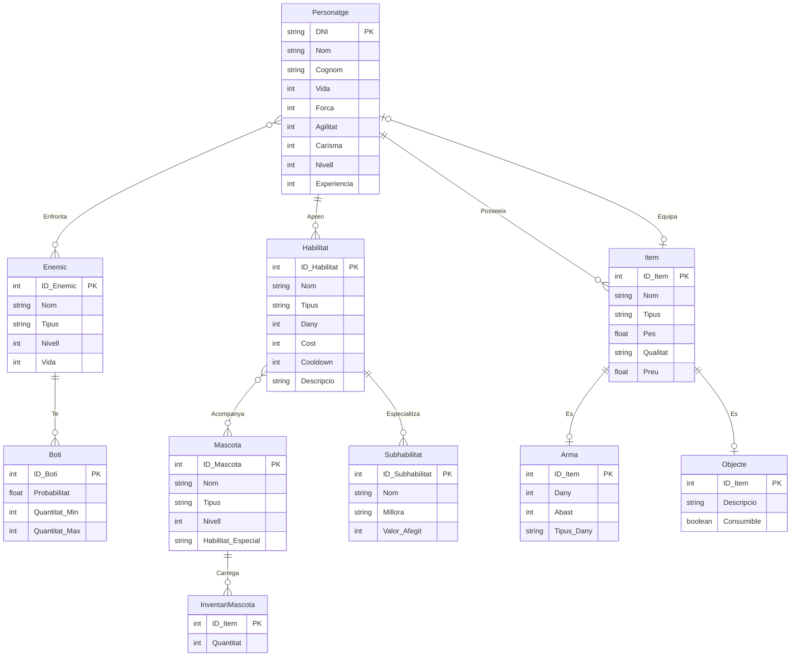

```mermaid
erDiagram
    Personatge ||--o{ Item : Posseeix
    Personatge o|--o| Item : Equipa
    Personatge ||--o{ Habilitat : Apren
    Personatge }o--o{ Enemic : Enfronta
    Enemic ||--o{ Boti : Te
    Mascota ||--o{ InventariMascota : Carrega
    Habilitat ||--o{ Subhabilitat : Especialitza
    Habilitat }o--o{ Mascota : Acompanya
    Item ||--o| Arma : Es
    Item ||--o| Objecte : Es

    Personatge {
        string DNI PK
        string Nom
        string Cognom
        int Vida
        int Forca
        int Agilitat
        int Carisma
        int Nivell
        int Experiencia
    }

    Item {
        int ID_Item PK
        string Nom
        string Tipus
        float Pes
        string Qualitat
        float Preu
    }

    Arma {
        int ID_Item PK
        int Dany
        int Abast
        string Tipus_Dany
    }

    Objecte {
        int ID_Item PK
        string Descripcio
        boolean Consumible
    }

    Habilitat {
        int ID_Habilitat PK
        string Nom
        string Tipus
        int Dany
        int Cost
        int Cooldown
        string Descripcio
    }

    Subhabilitat {
        int ID_Subhabilitat PK
        string Nom
        string Millora
        int Valor_Afegit
    }

    Enemic {
        int ID_Enemic PK
        string Nom
        string Tipus
        int Nivell
        int Vida
    }

    Boti {
        int ID_Boti PK
        float Probabilitat
        int Quantitat_Min
        int Quantitat_Max
    }

    Mascota {
        int ID_Mascota PK
        string Nom
        string Tipus
        int Nivell
        string Habilitat_Especial
    }

    InventariMascota {
        int ID_Item PK
        int Quantitat
    }
```
